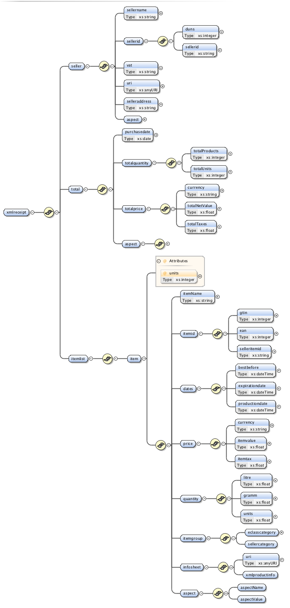

# xmlReceipt
Specification of the data format for digial, interactive sales slips that are more informative than the current paper based one 

## Introduction
A sales receipt documents the payment of a purchase (e.g. a grocery store) or service (e.g. catering).  A sales receipt is subject of fewer requirements than e.g. an invoice complaint to with § 14 UStG. For instance, a receipt usually does not include personalized information of the buyer (name and address) and an invoice. Up to a value of 150 euros of receipts is considered low value invoice (Kleinbetragsrechnung), if it confirms to the request of § 33 of the UStG implementing regulation (name, address, date and description of goods).

A user friendly receipt (“sprechender Kassenbon”) is a sales receipt on which the article descriptions in plain text are visible. In earlier times with simple cash registers of receipt contained only information on the group (z. B. alcohol) with the corresponding price. 

However, the lack of information has made it difficult for buyers for what exactly the money was spent. As a result, buyers needs in some cases an additional receipt with accurate mention of the product or service. Modern POS systems enable the details of the exact description of goods on the receipt. This is usually done by scanning the item ID or inputting a commodity code manually. The POS system use this item identifier to retrieve the needed information from the enterprise resource planning system.

The xmlReceipt (or it’s pet name eSlip) is the electronic equivalent to the paper based receipt. The electronic receipt enhances the concept of user friendly receipts by providing additional information e.g. including the best before or expiration date. In particular, the eSlip includes the identifier of each item (e.g. the GTIN or EAN) so that value services could use it to retrieve further information about the the goods purchased.  Among other things, the xmlReceipt enable added value services such as:
* Grouping purchased goods into item groups and provide aggregated information for each group.
* Give a warning in the case of food intolerances
* Perform a price comparison for the purchased goods
* Provide statistical information about regional or organic goods,
* Providing traffic light food labelling system aggregated about all purchases
* …

# Basic information and structure 
The xmlReceipt record presents essential information about a purchase, information consumer information systems must have to provide the outlined added value services.  The electronic receive should include following information:
- Name and address of business
- Tax identification number (VAT ID)
- Date and Time
- Product description including item id, item name and item groups
- Price of goods (retail gross price, otherwise net value) - optional also amount of goods and goods related dates
- optional, also separate sales tax expulsion by VAT rate of 7% and 19% respectively
The following give an example of a xmlReceipt record for an ordinary supermarket shopping

```xml
<xmlreceipt>
  <seller>
    <sellername>Mytime</sellername>
    <sellerid>SELLER.MYTIME</sellerid>
    <selleraddress>http://www.mytime.de</selleraddress>
  </seller>
  <itemlist>
    <item>
      <productname>Original Wagner Big Pizza BBQ-Chicken</productname>
      <productid>
        <ean>4009233012084</ean>
      </productid>
      <price>
        <currency>EUR</currency>
        <brutto>2.99</brutto>
      </price>
      <quantity>
        <gramm>420</gramm>
      </quantity>
      <itemgroup>
        <category name="Lebensmittel">
          <category name="Fastfood und ganze Fertiggerichte">
            <category name="Pizza und Pizzabaguette"></category>
          </category>
        </category>
      </itemgroup>
      <dates>
        <bestbefore>2017-09-29T03:49:45</bestbefore>
      </dates>
      <info>
        <!--You may enter ANY elements at this point-->
      </info>
    </item>
  </itemlist>
</xmlreceipt>
```
# Specification

 

*Figure 1 xmlReceipt XML scheme*

The xmlreceipt is an xml record that conforms to the XML scheme defined by the xmlreceipt.xsd file. The diagram above shows the general structure of XML scheme and every element that it can contain. Each element, along with all of its attributes, is documented in full below. 

## Root nodes 
The overall structure of a xmlReceipt is that first all seller information is given followed by the list of the purchased items. The root of a receipt recode is the xmlreceipt node. The node has two children: the seller node, which hold all information about the seller and the itemlist node, which holds all information about the purchased goods.

| Item       | Type    | Description                                                                      |
| -----------|---------|----------------------------------------------------------------------------------|
| xmlreceipt | node    | The xmlreceipt is the top-level node that holds all purchase information         |
| seller     | node    | The seller node holds all information about the seller where the goods were buy. |
| itemlist   | node    | The itemlist node holds all information about the purchase goods. The child nodes represent a purchased item. Information that relates to the purchased items in total (like the total price of the purchase) are either stored as an attribute the itemlist or as in an direct child node of the itemlist. |

# Seller information
The seller node holds all information about the seller where the goods are brought. 
The main entry is the sellername, which is present the common human-readable name of the seller like LIDL, ALDI, REWE. The seller also could provide an seller identifier and 
could also provide seller url, which costumer value services could use to request additional information (like logo, ratings, etc.) and show it the costumer in an appropriate way  

| Item       | Type      | Description                                                                                    |
| -----------|-----------|------------------------------------------------------------------------------------------------|
| sellername | xs:string | The human readable, common name of the seller                                                  |
| sellerid   | node      | A unique identifier of the seller like the DUNS or CRI (see Appendix)                          |
| sellervatin| xs:string | The value added tax identification number or VAT identification number (VATIN) of the seller   |
| sellerurl  | xs:anyURI   | An url provided by the seller to request further information                                 |
| selleraddress | xs:string|  The address of the seller                                                                   |

### Seller identifier information
Item | Type           | Description                                                                      |
| ---------|-----------|----------------------------------------------------------------------------------|
| duns     | xs:integer| [DUNS (Data Universal Numbering System](dnb.com/duns-number.html) is a unique nine-digit numbering system that is used to identify a business   |
| cri      | xs:string | Customer Reference Identifier: Unique company registration identifier                                                                           |
| sellerid | xs:string | Propretary, seller dependent identifier                                                                                                         |


The general structure of an *identifier element* is:  **\<code name>identifier\</code name>**. For instance \<duns>331411710\</duns> for the Lidl in Lampertswalde, Germany. 
A seller could also use its own identifier, even this is not recommended. In this case, the *identifier element* should look like this **\<sellerid>propritary_identifier\</sellerid>**. It is important that the identifier is the same on each xml receipt


# Total information
The total node holds all information, which relate to the entire purchasing or all items, respectively. 
Many elements are redudant, derived information that could be calculated by sum all items in the itemgroup. For instance the total price should be the sum of the item prices   

| Item          | Type    | Description                                                                                    |
|---------------|---------|------------------------------------------------------------------------------------------------|
| purchasedate  | xs:date | The date, when the purchase has made                                                           | 
| totalquantity | node    | Information of total sum of purchased items                                                    |
| totalprice    | node    | Information of total price of purchased items                                                  |
| aspect        | node    | Additional, proprietary information about the total purchase provided by the seller  (for the specification of the aspect node see below |

| Item       | Type      | Description                                                                                    |
| -----------|-----------|------------------------------------------------------------------------------------------------|
| totalitems | xs:integer | *derived attribute*: The number of the **different**, purchased items                         |
| totalunits | xs:integer | *derived attribute*: The number of **all** purchased items                                    |

| Item       | Type      | Description                                                                                                                             |
| -----------|-----------|-----------------------------------------------------------------------------------------------------------------------------------------|
| currency   | xs:string | *derived attribute*: The currency pf the price (in general, it will be the same currency as for the individual items                    |
| totalprice | xs:integer| *derived attribute*: The total price for the purchase (in general, it will the same as the sum of the price of each item, maybe rounded |
| totaltax   | xs:integer| *derived attribute*: The total tax for the purchase (in general, it will the same as the sum of the tax of each item, maybe rounded     | 

# Item information
The item node holds all information about an brought item (e.g. a good such as a refrigrator or a food product such as an apple).
The main entry is the itemname, which is present the common human-readable name of item similar to the one printed on a paper-based slip (like 'H-Milch, 1,5 % Fett').
In addition, item node also includes further information about dates, price, and quanity. Customer value services could retrieve further information by using the unique item identifier provided by the seller. In addition, the seller could also provide additional information like the product group of the item as well as proprietary, seller dependent aspects. Moreover, a whole infosheet could provided - still this is quite verbose.

The item have an attribute *units*, which defines how many of the item was purchased. By the default, the units value is 1 and can be omitted.
The *units*-attributes allows to group identical items together. This means, when a item *like foobar* is purchased twice than there are two ways to express this information

First, list the item twice
```xml
...
  <item><itemid>foobar</itemid>...</item>
  <item><itemid>foobar</itemid>...</item>
...
``` 

Second, list the item one once, but set the units attribute to express that item was purchase more than one 
```xml
...
  <item units="2"><itemid>foobaritemid>...</item>
...
``` 

Both expression are allowed. However, the second present the preferred, normalized version. 
**As a rule of thumb:** items with the same content should be grouped together and the units attributes should be set respectively.

| Item       | Type       | Description                                                                      |
| -----------|------------|----------------------------------------------------------------------------------|
| itemname   | xs:string  | A human readable, expressive name of the item                                    |
| item:units | xs:integer | attribute of the item elements defining how many of the item was purchased.      |
| itemid     | node       | A unique identifier of the item                                                  |
| dates      | node       | Item related dates such as production date, best before date, ...                |
| price      | node       | The price and currency of the item                                               |
| quantity   | node       | Item related quantities such as the size of the package in gramm or litre        |
| itemgroup  | node       | Informations about the categories the item belongs to                            |
| infosheet  | node       | A subset or a complete item infosheet following the xmlProductInfo standard. (see: __TODO__) |
| aspect     | node       | Proprietary, seller dependent information about the item                         |


## Item identifier 
The item identifier is provide one or more  identifier of the purchased item. The identifier allows to store and retrieve item information more easily. Moreover, the given identifier(s) primarily serves as a kind of foreign key to link the xmlReceipt with other data sources such as enterprise ressource planing systems, price portals, product information portals, etc.
Hence, item identifier(s) should provided that based on widespread, well established code systems. Regarding this, various of such code systems exists in the retail market.

The most important one are:
*    [UPC](https://en.wikipedia.org/wiki/Universal_Product_Code) –  The Universal Product Code (UPC) is a 12-digit barcode system hat is widely used in US, Canada, and UK 
*    [EAN](ean-int.org ) –  The European Article Number (EAN) is widely used in continental Europe. The EAN-13 is based on the UPC and includes the 13 digits (also called EAN-13). To translate a UPC code to a EAN-13 number a leading zero is set. There is a shorter version (also called EAN-8), which consists of 8 digits. 
*    [GTIN](http://www.gs1.org/gtin) – The Global Trade Item Number (GTIN) code family become more and more the de-facto standard. This hitherto latest code for product identification summarizes all previous markings and uses leading zeros, to continue with the previous 12-, 13-, and 8-digit codes.
*    [ISBN](http://www.iso.org/iso/catalogue_detail?csnumber=36563) – The International Standard Book Number (ISBN) as a unique international identification system for each product form or edition of a monographic publication published or produced by a specific publisher. Nowadays the  ISBN is compatible with the EAN .
*    [ASIN](https://en.wikipedia.org/wiki/Amazon_Standard_Identification_Number) – The "Amazon Standard Identification Number (ASIN) is a 10-digit alphanumeric code, which was introduced by Amazon to facilitate the communication between business partners on the Internet and the internal data processing on Amazon.

The general structure of an *identifier element* is:  **\<code name>identifier\</code name>**. For instance \<asin>B00DQDJBGM\</asin> for the "The Macallan Anniversary"-Whiskey
A seller could also use its own code system, even this is not recommended. In this case, the *identifier element* should look like this **\<sellerid>propritary_identifier\</sellerid>**. For instance, the seller REWE use for the item "ja! Fettarme H-Milch 1,5% 1l" the seller its own article id 6509371. Then the xmlReceipe might include the elemenent \<sellerid>6509371\</sellerid> for the item. 
It might also provide an additional, own identifier id e.g. a RSIN (REWE Standard Identification Number) **\<rsin>6509371\</rsin>**

| Item | Type           | Description                                                                      |
| ---------|------------|----------------------------------------------------------------------------------|
| gtin     | xs:string  | GTIN code of the item                                                            |
| ean      | xs:integer | EAN code of the item                                                             |
| ean13    | xs:integer | EAN-13 code of the item                                                          |
| ean8     | xs:integer | EAN-8 code of the item                                                           |
| upc      | xs:integer | UPC code of the item                                                             |
| isbn     | xs:string  | ISBN code of the item                                                            |
| ismn     | xs:string  | item identifier is encoded by theInternational Standard Music Number (ISO 10957:1993) - typically used for musi	 	           |
| issn     | xs:string  | item identifier is encoded by the International Standard Serial Number (ISO 3297:1998) - typically used for news papers and magazins|
| asin     | xs:string  | ASIN code of the item                                                            |
| sellerid | xs:string  | item identifier is encoded by a propritary, seller dependent code system         |


## Item dates 
~~**TODO** Add some general remarks about the element and its purposeAt vero eos et accusam et justo duo dolores et ea rebum. Stet clita kasd gubergren, no sea takimata sanctus est Lorem ipsum dolor sit amet.
Lorem ipsum dolor sit amet, consetetur sadipscing elitr, sed diam nonumy eirmod tempor invidunt ut labore et dolore magna aliquyam erat, sed diam voluptua~~


| Item       | Type    | Description                                                                      |
| -----------|---------|----------------------------------------------------------------------------------|
| __TODO__  | __TODO__     | __TODO__         |

## Item prices 
The item price holds all price related data of the item. The price is given in the currency defined by the currency-element.
The currency code is specified by the the ISO 4217 standard (e.g. 'EUR' for the Euro). 

| Item       | Type      | Description                                 |
| -----------|-----------|---------------------------------------------|
| currency   | xs:string | The name of the price currency.             |
| itemprice | xs:integer| The item price (in the specified currency)   |
| itemtax   | xs:integer| The item tax (in the specified currency)     |                                  

## Item quantities 
~~**TODO** Add some general remarks about the element and its purposeAt vero eos et accusam et justo duo dolores et ea rebum. Stet clita kasd gubergren, no sea takimata sanctus est Lorem ipsum dolor sit amet.
Lorem ipsum dolor sit amet, consetetur sadipscing elitr, sed diam nonumy eirmod tempor invidunt ut labore et dolore magna aliquyam erat, sed diam voluptua~~

| Item       | Type    | Description                                                                      |
| -----------|---------|----------------------------------------------------------------------------------|
| __TODO__  | __TODO__     | __TODO__         |

## Item group 
~~**TODO** Add some general remarks about the element and its purpose At vero eos et accusam et justo duo dolores et ea rebum. Stet clita kasd gubergren, no sea takimata sanctus est Lorem ipsum dolor sit amet.
Lorem ipsum dolor sit amet, consetetur sadipscing elitr, sed diam nonumy eirmod tempor invidunt ut labore et dolore magna aliquyam erat, sed diam voluptua~~

The most important one are:
*    [eClass](http://www.eclass.eu) –  The eClass is a industry standard for the classification and description of products and services
*    [UNSPSC](https://www.unspsc.org/) – The United Nations Standard Products and Services Code is an open, global, multi-sector standard for the classification of products and services managed by GS1.
*    [CPV](http://eur-lex.europa.eu/legal-content/EN/TXT/?uri=URISERV:l22008) – The Common Procurement Vocabulary (CPV) has been developed by the European Union as a single classification system to describe the subject matter of public contracts. It consists of a main entry defining the subject of a contract, and a supplementary vocabulary for adding further qualitative information 

 The general structure of an *group item element* is:  **\<itemgroup codename="identifier"/>**. For instance \<itemgroup eclass="16-08-02-03" name="Hammelfett" language="DE-de"/>
 A seller could also use its own code system, even this is not recommended. In this case, the *identifier element* should look like this **\ **\<itemgroup sellergroupid="identifier"/>**.  


| Item            | Type           | Description                                                                                |
| ----------------|----------------|------------------------------------------------------------------------------------------------|
| itemgroup:name  | xs:string      | human readable name of the group category                                              |
| itemgroup:language  | xs:string  | language of the human readable name given by the ISO 639 language code             |
| itemgroup:eclass  | xs:string    | [eClass](http://www.eclass.eu) code of the item group                                |
| itemgroup:unspsc  | xs:string    | [UNSPSC](https://www.unspsc.org/) code of the item group                             |
| itemgroup:cpv     | xs:string    | [CPV](http://eur-lex.europa.eu/legal-content/EN/TXT/?uri=URISERV:l22008) code of the item group|
| itemgroup:sellergroupid | xs:string  | category identifier is encoded by a propritary, seller dependent code system         |


## Item sheet and aspects
~~**TODO** Add some general remarks about the element and its purposeAt vero eos et accusam et justo duo dolores et ea rebum. Stet clita kasd gubergren, no sea takimata sanctus est Lorem ipsum dolor sit amet.
Lorem ipsum dolor sit amet, consetetur sadipscing elitr, sed diam nonumy eirmod tempor invidunt ut labore et dolore magna aliquyam erat, sed diam voluptua~~

| Item       | Type    | Description                                                                      |
| -----------|---------|----------------------------------------------------------------------------------|
| __TODO__  | __TODO__     | __TODO__         |


#Referred Standards

##Country dependent information

| Name       | Referred code list    | Description                                    |
| -----------|--------------|--------------------------------------------------------------|
| Country    | ISO 3166-1   | __TODO__                                                     |
| Currency   | ISO 4217     | __TODO__                                                     |
| Language   | ISO 639      | __TODO__                                                     |


##Item category


## Aspect
| Code             | International code list    | Description                                        |
| -----------------|------------------|--------------------------------------------------------------|
| Delivery terms   | UN/EDIFACT No 5  | __TODO__                                                     |
| Unit of Measure  | UN/ECE N°20      | __TODO__                                                     |


